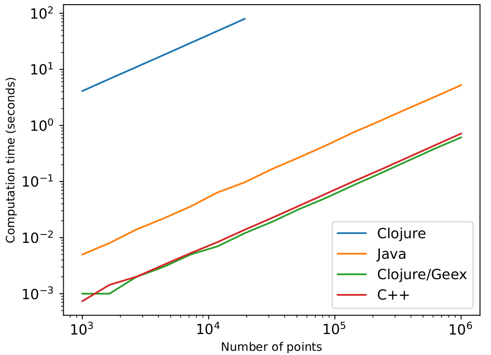
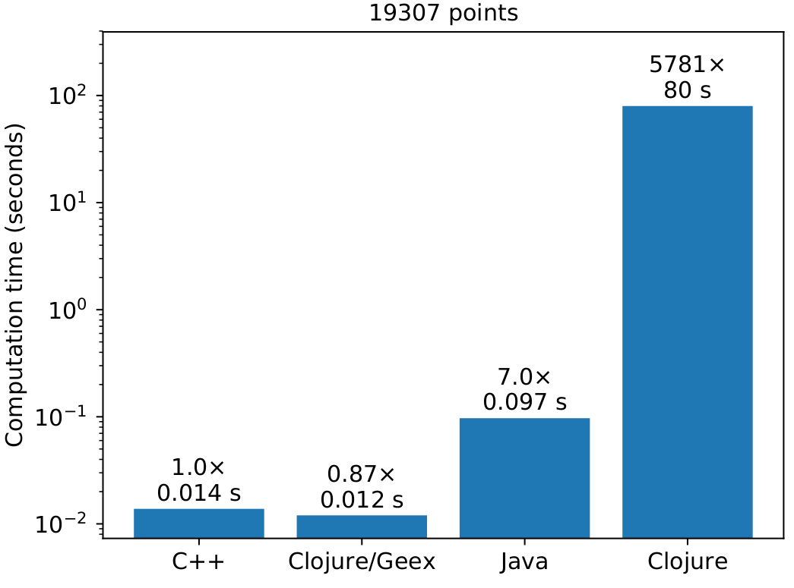
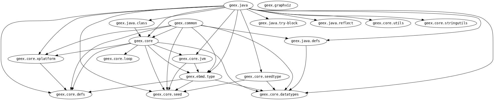

# Generative Expressions

Generative Expressions (Geex) is a code generation tool for writing high-level Clojure code that generates fast low-level code.

## Example

Here is an implementation for computing the square-root of a number using [Newton-Raphson](https://en.wikipedia.org/wiki/Newton%27s_method):
```clj
(ns examples.sqrt-test
  (:require [geex.common :as c]
            [geex.java :as java]
            [geex.core :as gx]
            [clojure.test :refer :all]))

(defn sqrt-iteration [k x]
  (c/- x (c// (c/- (c/* x x) k)
              (c/* 2.0 x))))

(java/typed-defn unrolled-sqrt [Double/TYPE x]

                 ;; Display time and generated code:
                 (gx/set-flag! :disp :disp-time :format)
                 
                 (->> x
                      (iterate (partial sqrt-iteration x))
                      (take 10)
                      last))
```
which results in a function ```unrolled-sqrt``` that we can call:
```clj
(unrolled-sqrt 2.0)
;; => 1.4142135623730951
```

This is the code that was generated in order to produce this function:
```java
package examples_psqrt_dtest;

public class TypedDefn__unrolled_dsqrt {
  /* Various definitions */
  public double apply(final double arg00) {
    final double s0012 = (arg00 - (((arg00 * arg00) - arg00) / (2.0 * arg00)));
    final double s0018 = (s0012 - (((s0012 * s0012) - arg00) / (2.0 * s0012)));
    final double s0024 = (s0018 - (((s0018 * s0018) - arg00) / (2.0 * s0018)));
    final double s0030 = (s0024 - (((s0024 * s0024) - arg00) / (2.0 * s0024)));
    final double s0036 = (s0030 - (((s0030 * s0030) - arg00) / (2.0 * s0030)));
    final double s0042 = (s0036 - (((s0036 * s0036) - arg00) / (2.0 * s0036)));
    final double s0048 = (s0042 - (((s0042 * s0042) - arg00) / (2.0 * s0042)));
    final double s0054 = (s0048 - (((s0048 * s0048) - arg00) / (2.0 * s0048)));
    return (s0054 - (((s0054 * s0054) - arg00) / (2.0 * s0054)));
  }
}
```

## Getting started

Geex can be obtained as a Maven dependency, so in your Leiningen project, you just have to add the line
```clj
[geex "0.11.0"]
```

## Tutorial

There is a *work-in-progress and incomplete* [tutorial](doc/tutorial.md) that you can read.

You can also try it out by cloning this repository and looking at [the examples](test/examples), such as 
  * How to [compute the square root](test/examples/sqrt_test.clj) using Newton-Raphson
  * Forward-mode [automatic differentiation](test/examples/ad_test.clj)
  * [Circle fitting](test/examples/circle_fit_test.clj)
  * [Expression templates](test/examples/expr_templates_test.clj) on vectors à la C++
  * More [matrix operations](test/examples/matrix_test.clj) (without expression templates).
  * [Covariance matrix](test/examples/covariance_test.clj) computation.
  * [Another circle fitting](test/examples/cljd_circle_test.clj) example making use of operator overloading.
  * Naïve [N-body simulation](test/examples/nbody_test.clj).

## Benchmark

To assess the effectiveness of this approach, we tried to estimate the parameters of a circle (centre x and y position, and radius) from a set of 2D observations. We do this by formulating an objective function that is minimized using gradient descent. The gradient is computed using forward mode automatic differentiation.

This algorithm was implemented in high-level [Java](https://github.com/jonasseglare/cljd2019/blob/master/srcjava/cljd/CircleOpt.java), [C++](https://github.com/jonasseglare/cljd2019/blob/master/cpp/circleopt.cpp), and [Clojure](https://github.com/jonasseglare/cljd2019/blob/master/src/cljd/circle.clj) (with and without Geex). The computation times were measured for varying numbers of points to which we fit the circle parameters.

Plotting the computation time as a function of number of circle points results in this plot:




Specifically, for 19307 points, we get these computations times:



Please note that these tests measure *high-level* implementations that *have not been optimized*. There is room for error. You may get other results than I do, depending on your setup.

## API Reference

The API reference documentation can be found at [cljdoc.org](https://cljdoc.org/d/geex/geex/CURRENT).

### Module structure
If you add ```[lein-ns-dep-graph "0.2.0-SNAPSHOT"]``` to your Leiningen plugins, this graph can be generated using ```lein ns-dep-graph```:


```geex.core``` contains the core components of code generation and analysis.

```geex.common``` is a library of common operations.

```geex.java``` contains specific support for the Java platform.

## Issues and features to address

Important or easy to implement:
 * Simplifications of the core:
   - Sort out the recur-spaghetti... or simplify it.
   - Fewer mutations, if possible. Concentrate them to SeedState.
 * Sequence stuff: drop, take, take-while, filter, etc.
 * array and vec functions: Export a lazy seq to a vector.
 * Refactor, so that a seed has typeInfo, instead of type. And typeInfo wraps the type with meda data.

Less important:
 * Provide JavaSourceClassLoader as parent class loader to SimpleCompiler. This will allow it to use previously compiled classes. Or maybe better, whenever we cook something, we set the parent class loader to be the new class loader.
 * A class registry, mapping full class name to a function producing a class. It will first look in the class loader (which is a JavaSourceClassLoader). This registry is used for structs and struct arrays, so that structurally equivalent things map the same.
 * An export function that is called on all values returned. By default, it returns the value unchanged. But it can be extended, so that for ::iterables it turns them into lazy seqs, and for matrix expressions it turns them into MDArrays.
 * Implement ILookUp etc for seeds, so that we can apply keywords and nth and count to seeds.
 * Figure out namespace
 * Add dependencies between stateful, respect scope.
 * Prohibit some chars in typed-defn names, such as >, <
 * Strip away operations without sideeffects if they are not needed.
 * Unite identical pure operations.
 * Contiguous structured arrays.
 * Calling super of class that we extend.
 * Cartesian product
 * Better management of homogenization of slightly different values between branches in conditional forms: Maybe, if there is no change in the value, we reset the type???

## Design

### Getting the current namespace

```
(defmacro this-ns []
  (let [s (gensym)]
    `(do (def ~s)
         (-> (var ~s)
             (.ns)
             ;(.getName)
             ;name
             ))))
```

### Structs and Struct array
Add a module ```geex/java/struct```, interface ```IStruct``` and interface ```IStructArray```.

```IStruct``` has methods ```getData```, ```setData```, ```make```, ```getFloat0```, ```getTypeSignature```.
```IStructArray``` has methods ```getData```, ```setData```, ```getStruct```, ```setStruct```, ```getFloats```, ```getDoubles```, ```getTypeSignature```.

A struct is a structural type. Its class can be defined on-the-fly e.g. ```(struct {:a Double})```. In the background, it does the following:
    * Generates a unique name for it based on its shape.
    * In a map, if a java.lang.Class already exists at that key, then return it. Otherwise, save it to disk and load it again with the JavaSourceClassLoader of Janino.

There is also a construct, ```data-class-template```, that lets us defined polymorphic classes, e.g.

```clj
(def-data-class-template my-bbox
  (fn [data-shape]
    {:interfaces [IBBox]
     :methods [{:name "extend"
                :arg-types [Object]
                :fn (fn [this x] ...)}}))
```
and then we can simply call ```(my-bbox {:minv [Double Double] :maxv [Double Double]})``` to generate a specialized class implementing these methods... that has polymorphic behaviour.

## Contributions

You can contribute by filing bug issues. Fixing minor issues such as failing builds for different platforms is also important.

## License

Copyright © 2019 Jonas Östlund

Distributed under the Eclipse Public License either version 1.0 or (at
your option) any later version.
